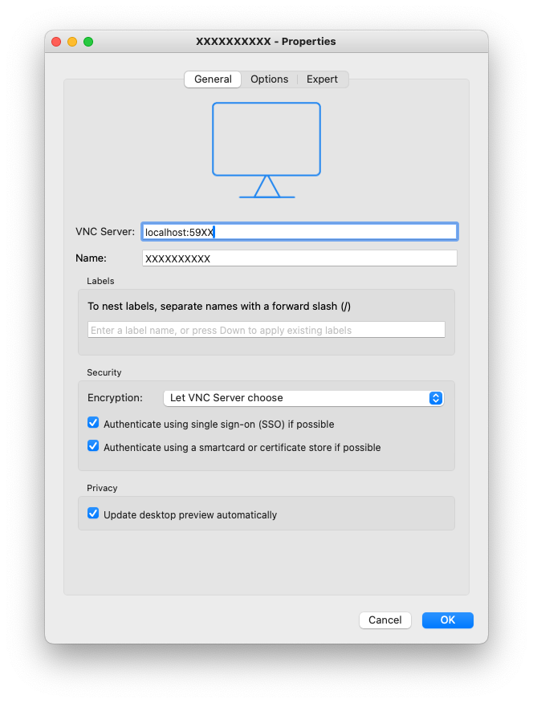
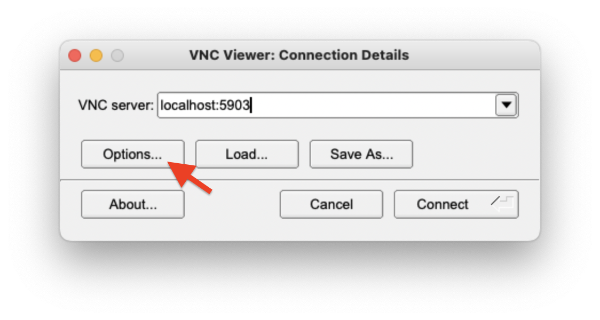
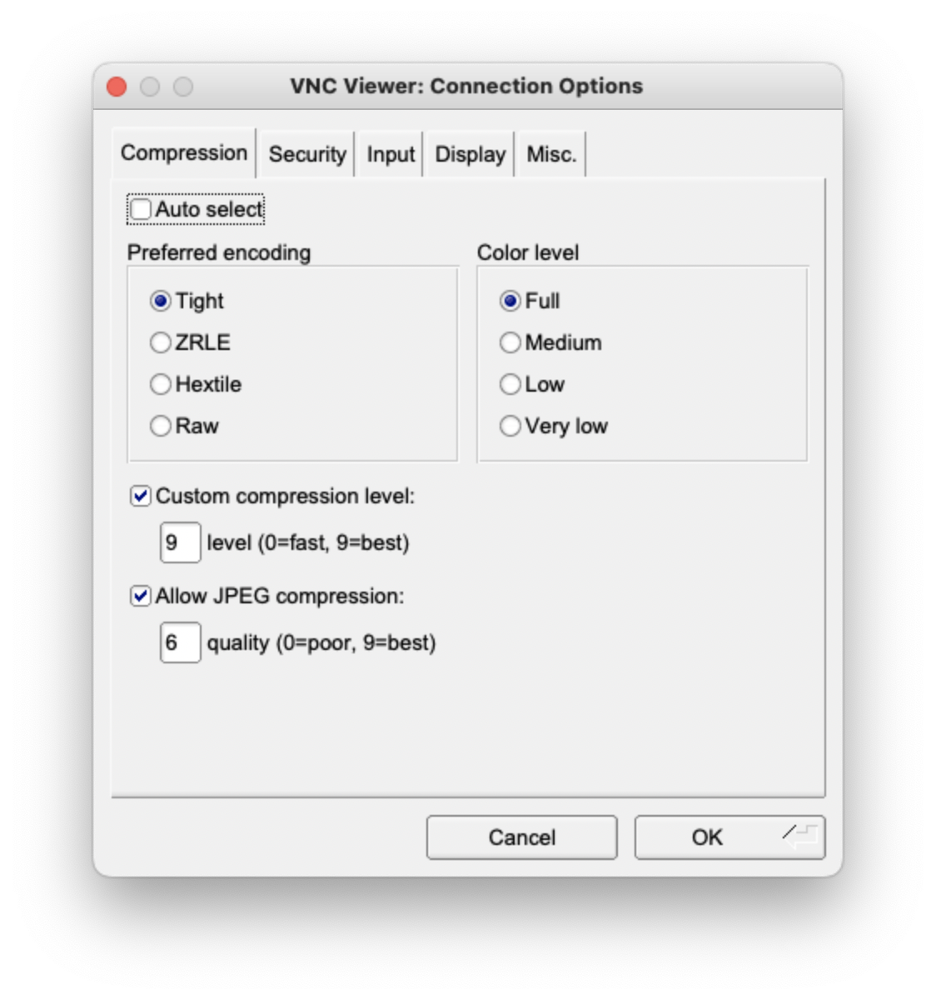

# Connect to CPSL servers via VNC + SSH
## About
For security and VPN firewall reasons, we ask you to connect to the VNC via SSH tunneling.

How this works: 
* Usually, VNC listens to connections at port 590X, where X is a number for the VNC connection. However, such ports are blocked by the IT off campus for security reasons.
* How to bypass this port? Use ssh. 
* The ssh port 22 is open for all to use. Instead of connection to the vncserver via port 590X, we can re-direct or forward the port 590X and the network traffic in this port to your own computer via the ssh port 22.


## Preparation
***If you don't know any of the following, please talk with me.***

***Make sure you connect to the VPN before doing everything.***

Have a port number you will use. 
**Assume it is, \<NUM\>.**

Also have \<REMOTE_USER\> and \<REMOTE_HOST\> ready.

\<REMOTE_USER\> is usually the server account for you.
\<REMOTE_HOST\> is a ip address or a link ends with wustl.edu.

## Connection
### 1. Create a VNC session
Log into the server via ssh. To create a VNC session, run the following in the terminal.

* Create a 1080p screen (Recommended, unless you need higher resolution.):
`vncserver :{NUM} -geometry 1920x1080 -nolisten tcp -depth 24`

* Create a 2K screen (Needs high bandwidth. Works OK on campus.):
`vncserver :{NUM} -geometry 2560x1440 -nolisten tcp -depth 24`


<font color="red"> !!! Note that there is a : before the number!!! </font>

### 2. Create ssh tunnel
Documentation: https://www.ssh.com/academy/ssh/tunneling-example

`ssh -NL 59XX:localhost:59XX <REMOTE_USER>@<REMOTE_HOST>`

Here, XX = {NUM}.

## VNC Viewer
### Download the VNC viewer
For example, 
* RealVNC: https://www.realvnc.com/en/connect/download/viewer/
* Tiger VNC: https://github.com/TigerVNC/tigervnc/releases

RealVNC can save the password for connection and multiple connection instances, but I find it has more lagging than the TigerVNC. TigerVNC in general has better smoothness if you are accessing the server from a far location. If you are on campus or at the same city, both should work well.

### [RealVNC] Configure the connection
<!--  -->



If you are using RealVNC, you may Config the VNC as this.

After config, you may connect to the desktop.

### [TigerVNC] Configure the connection
If you are using RealVNC, you may Config the VNC as in the first line **"VNC server:"**.
<!--  -->


If you are accessing the server from remote or have limited network bandwidth, it is optional but recommended to configure the compression level from the option button pointed by the red arrow and configure as the following.
* Recommended options: Tiger encoding, Full color level (it can be lower and the color may look different), ~9 level compression and ~6 JEPG quality.
* The best option for you may need trying out different combinations.
<!--  -->


## Manage the VNC sessions
### Check the status of created VNCs or if a VNC is now running
After creating the vnc sessions, you may check the status of created VNC sessions with

```ps -ef | grep `whoami` | grep vnc```

### Kill certain VNC sessions

In order to kill vnc session for certain port, run

```vncserver -kill :{NUM}```

To terminate ***all*** vncs,

```vncserver -kill :*```